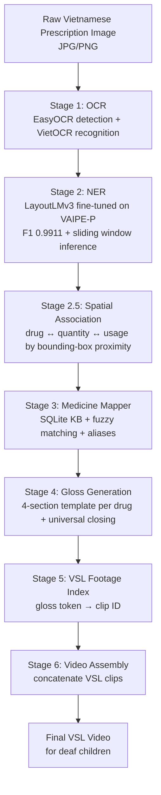

# VSL26: Vietnamese Prescription to Sign Language Pipeline

## Overview

VSL26 is an end-to-end research pipeline that turns a Vietnamese prescription image into structured Vietnamese Sign Language (VSL) gloss output for deaf children. The system performs OCR, prescription NER, drug knowledge-base matching, child-friendly clinical explanation, and VSL gloss generation. The research goal is an evaluation study: measure whether children understand medication instructions better with VSL video than with paper prescriptions. The pipeline is infrastructure for that study, so correctness, traceability, and a locked pilot scope matter more than model comparison.

## Pipeline Stages



Status: Stages 1-5 are implemented for the locked pilot set. Stage 6 needs final footage IDs and assembly. Stage 7 is the user evaluation study.

## Setup

Python 3.11 with a virtual environment is recommended.

```bash
python3 -m venv .venv
source .venv/bin/activate
pip install -r requirements.txt
```

OCR uses EasyOCR for CRAFT text detection and VietOCR for Vietnamese recognition. PaddleOCR was tested and replaced because Vietnamese diacritics were unreliable on the prescription images.

The LayoutLMv3 Stage 2 checkpoint must be placed at `./models/`. The checkpoint is not committed because it is large. The expected directory contains files such as `config.json`, `model.safetensors`, `processor_config.json`, `tokenizer.json`, `tokenizer_config.json`, and `training_args.bin`.

The VAIPE-P dataset is available at [Kaggle: vaipepill2022](https://www.kaggle.com/datasets/tommyngx/vaipepill2022). Extract only the prescription subset when possible:

```bash
unzip -o vaipepill2022.zip 'public_train/prescription/*' -d .
```

## Quickstart

Run the locked four-prescription pilot gloss test:

```bash
python test_gloss_engine.py
```

Run one full end-to-end OCR → NER → Mapper test:

```bash
python test_full_pipeline.py
```

Create the video-editor handoff workbook:

```bash
python export_pilot_video_excel.py
```

## Project Structure

Core pipeline files:

- `ocr_engine.py` — Stage 1 OCR using EasyOCR detection and VietOCR recognition.
- `inference.py` — Stage 2 LayoutLMv3 NER inference, sliding-window handling, cleanup, and spatial drug-usage association.
- `medicine_mapper.py` — Stage 3-4 drug KB matching, structured gloss generation, and VSL token lookup.
- `test_full_pipeline.py` — single-prescription end-to-end smoke test.
- `test_gloss_engine.py` — locked four-prescription pilot gloss validation and manifest generation.

Useful utilities:

- `count_drugs.py` — counts and normalizes drug entities from VAIPE-P labels.
- `build_pilot_subset.py` — finds prescriptions eligible for the four-drug pilot scope.
- `build_synthetic_dataset.py` — builds batch drug-diagnosis rows from NER exports.
- `export_ner_dataset.py` — exports all labeled VAIPE-P entities for inspection.
- `export_test_predictions.py` — exports OCR+NER predictions for public test prescriptions.
- `merge_test_predictions.py` — merges adjacent token predictions into phrase rows.
- `import_atc_dataset.py` — imports WHO ATC level-5 drug names into the SQLite KB.
- `update_needed_kb.py` — translates only safe matched drugs needed by project data.
- `prepare_unresolved_drug_review.py` — builds the unresolved-drug manual review queue.
- `build_final_drug_review_actions.py` — builds final human-review action sheets.
- `apply_verified_decisions_wave1.py` — applies verified Wave 1 KB decisions.
- `export_pilot_video_excel.py` — creates the pilot video-editing Excel workbook.

Diagnostic and research-audit files:

- `debug_annotation_format.py` — inspects VAIPE-P annotation granularity.
- `debug_gt_vs_ocr.py` — compares NER behavior on ground-truth vs OCR inputs.
- `screen_pilot_replacements.py` — screens pilot replacement candidates.
- `wave1_validation.py` — validates KB cleanup effects.
- `test.ipynb` — original LayoutLMv3 training notebook.

## Pilot Study Scope

The locked pilot uses four single-drug prescriptions:

- Amlodipine: `VAIPE_P_TRAIN_904`
- Enalapril: `VAIPE_P_TRAIN_457`
- Amoxicillin: `VAIPE_P_TRAIN_871`
- Paracetamol: `VAIPE_P_TRAIN_877`

Pipeline status:

- ✅ Engineering pipeline complete for the locked pilot prescriptions.
- 🔧 VSL footage assignment pending for placeholder gloss tokens.
- ⏸️ User evaluation with deaf children pending.

## Research Findings

- LayoutLMv3 inference initially lost drug rows because `max_length=224` truncated long prescriptions. Sliding-window inference fixed this without retraining.
- Subword predictions must be aggregated back to word/entity level using `encoding.word_ids()`.
- Bounding boxes must be normalized to `[0, 1000]`; raw pixel boxes degrade LayoutLMv3 spatial embeddings.
- Vietnamese prescription annotations are phrase-level, not word-level, so OCR phrases should generally be passed directly to NER.
- Vietnamese prescriptions frequently use brand names rather than generic names, requiring alias-heavy KB mapping.
- Traditional Vietnamese medicines appear often enough to need explicit handling instead of forcing Western ATC mappings.

## Citing / Contact

This repository is research infrastructure for the VSL26 Vietnamese prescription-to-VSL evaluation study. Cite the VAIPE-P dataset and the WHO ATC/DDD source where relevant. Contact the project maintainer before using generated pilot materials in participant-facing evaluation.
