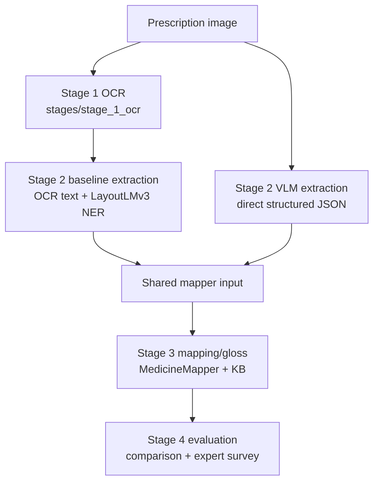

# VSL26: Vietnamese Prescription to Sign Language Gloss Pipeline

VSL26 is a research codebase for converting Vietnamese prescription images into
structured Vietnamese Sign Language (VSL) glosses for expert evaluation. The
current study compares a classical document-AI baseline against a vision-language
model (VLM) extraction path, then sends both paths through the same medication
mapping and gloss generation logic.

The current evaluation target is expert review of generated gloss quality. Video
assembly remains downstream infrastructure and is not the active evaluation
method for this branch.

## Current Research Frame

- Input: Vietnamese prescription images from VAIPE, archive/screenshot samples,
  and real-world prescription photos.
- Baseline: EasyOCR/VietOCR text extraction followed by LayoutLMv3 NER.
- Proposed method: VLM direct structured extraction from the prescription image.
- Shared downstream path: drug normalization, knowledge-base mapping, safety-aware
  instruction simplification, and VSL gloss generation.
- Evaluation: blinded or randomized expert survey with image plus generated gloss,
  one required 1-5 score, and one optional free-text comment.

See [docs/RESEARCH_PROTOCOL.md](docs/RESEARCH_PROTOCOL.md) for the study design.

## Architecture



Detailed architecture and data contracts are documented in
[docs/ARCHITECTURE.md](docs/ARCHITECTURE.md).

## Setup

Python 3.11 is recommended.

```bash
python3 -m venv .venv
source .venv/bin/activate
pip install -r requirements.txt
```

Create a local `.env` from `.env.example` when using the VLM path:

```bash
cp .env.example .env
```

Do not commit `.env`, model checkpoints, downloaded datasets, or generated survey
images/results.

## Required Local Artifacts

The repository intentionally does not commit large or private artifacts.

- `models/`: LayoutLMv3 checkpoint files such as `config.json`,
  `model.safetensors`, tokenizer files, and `training_args.bin`.
- `public_train/` or `data/vaipepill2022/`: VAIPE-P dataset when running
  training or VAIPE-based inference.
- `vaipe_drugs.db`: SQLite medication knowledge base.
- `.env`: local OpenAI API credentials for VLM extraction or KB enrichment.

## Common Commands

Run the locked gloss smoke test:

```bash
python test_gloss_engine.py
```

Run one OCR to NER to mapper smoke test:

```bash
python test_full_pipeline.py
```

Compare extraction methods on one image:

```bash
python compare_extraction_methods.py --image /path/to/prescription.png --method both
```

Run only the VLM extraction path:

```bash
python compare_extraction_methods.py --image /path/to/prescription.png --method vlm
```

Create the expert survey package from prepared manifests:

```bash
python export_expert_survey.py
```

See [docs/OPERATIONS.md](docs/OPERATIONS.md) for cloud training, local
functional checks, and survey generation commands.

## Project Map

Stage-organized implementation:

- `stages/stage_1_ocr/ocr_engine.py`: EasyOCR/VietOCR OCR.
- `stages/stage_2_extraction/inference.py`: LayoutLMv3 NER inference, sliding
  windows, GAT checkpoint compatibility, and entity parsing.
- `stages/stage_2_extraction/llm_extractor.py`: VLM direct prescription
  extraction with strict JSON output.
- `stages/stage_3_mapping/medicine_mapper.py`: medication KB matching,
  drug-purpose mapping, gloss generation, and VSL token lookup.
- `stages/stage_4_evaluation/compare_extraction_methods.py`: shared comparison
  harness for baseline and VLM.
- `stages/stage_4_evaluation/export_expert_survey.py`: expert survey package
  generation.
- `stages/stage_4_evaluation/prepare_vaipe_sample.py`: reproducible VAIPE image
  sampling for survey preparation.

Compatibility wrappers remain at the repository root (`ocr_engine.py`,
`inference.py`, `medicine_mapper.py`, etc.) so existing scripts and notebooks do
not break.

Training and validation:

- `training/train_layoutlmv3_vaipe.py`: safe VAIPE-only LayoutLMv3 retraining.
- `training/functional_extraction_check.py`: functional check on unlabeled survey
  images.
- `training/run_overnight_venus13.sh`: unattended iHPC/Venus13 training runner.
- `training/README_venus13_retrain.md`: step-by-step retraining runbook.

Research docs:

- [AGENTS.md](AGENTS.md): repository guidance for future agents and maintainers.
- [docs/ARCHITECTURE.md](docs/ARCHITECTURE.md): system design and data contracts.
- [docs/RESEARCH_PROTOCOL.md](docs/RESEARCH_PROTOCOL.md): paper framing and
  evaluation design.
- [docs/EXPERT_SURVEY.md](docs/EXPERT_SURVEY.md): expert survey build and review
  protocol.
- [docs/OPERATIONS.md](docs/OPERATIONS.md): reproducible commands and artifact
  handling.

## Known Findings

- LayoutLMv3 is strong on VAIPE-style layouts but brittle on unseen prescription
  formats.
- OCR quality and layout shift are the main failure points for the baseline.
- VLM extraction improves layout robustness but must be evaluated through a
  shared downstream mapper to avoid moving the target.
- The research contribution should be framed around accessible medication
  communication, auditable extraction-to-gloss mapping, and expert-validated VSL
  gloss quality rather than claiming OCR novelty alone.
