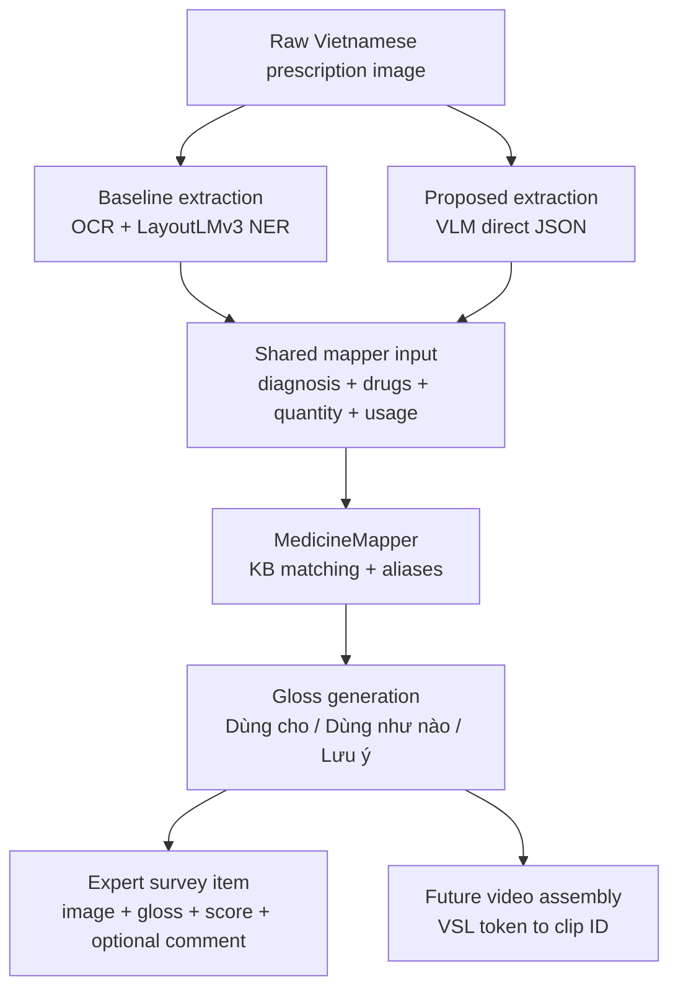

# VSL26 Pipeline Overview

VSL26 converts Vietnamese prescription images into VSL gloss candidates for
expert review. The active branch compares two extraction methods while keeping
the downstream medication mapping and gloss generation path shared.

## High-Level Pipeline

## Data Flow

1. Prescription image enters either the baseline extractor or VLM extractor.
2. The extractor produces normalized diagnosis and drug rows.
3. `MedicineMapper` maps extracted names to the SQLite medication KB.
4. The mapper generates safety-aware VSL gloss sections.
5. The expert survey asks specialists to score the generated gloss.

## Extraction Methods

| Method | Files | Strength | Expected weakness |
|---|---|---|---|
| OCR + LayoutLMv3 | `stages/stage_1_ocr/ocr_engine.py`, `stages/stage_2_extraction/inference.py` | Strong on VAIPE-like layouts | Brittle under layout shift and OCR noise |
| VLM direct extraction | `stages/stage_2_extraction/llm_extractor.py` | More robust to layout variation | Can structure visible text incorrectly |

Both methods must feed the same mapper input shape before comparison.

## Knowledge Base

The KB is `vaipe_drugs.db`. It contains imported WHO ATC terms, project-specific
VAIPE drug additions, aliases, and curated gloss fields. The KB is a local
artifact and is not committed on this branch.

## Current Status

| Area | Status |
|---|---|
| OCR + LayoutLMv3 baseline | Implemented |
| VLM direct extractor | Implemented |
| Shared mapper/gloss path | Implemented |
| Stage folder organization | Implemented under `stages/` with root compatibility wrappers |
| LayoutLMv3 Venus13 retraining scripts | Implemented |
| 30-image expert survey export | Implemented locally |
| Expert response collection | Pending |
| Statistical analysis of expert scores | Pending |
| Video assembly | Future work |

## Main References

- [ARCHITECTURE.md](ARCHITECTURE.md)
- [RESEARCH_PROTOCOL.md](RESEARCH_PROTOCOL.md)
- [EXPERT_SURVEY.md](EXPERT_SURVEY.md)
- [OPERATIONS.md](OPERATIONS.md)
