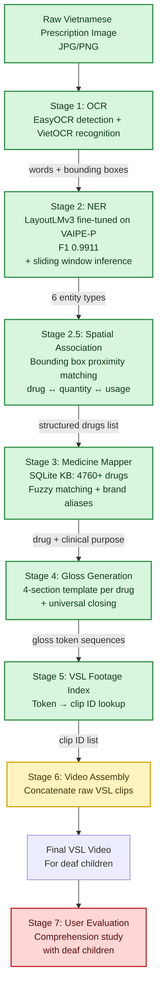
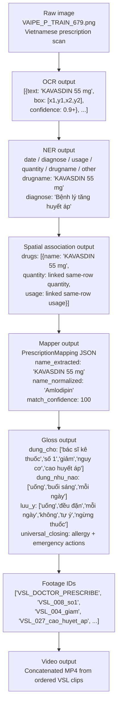
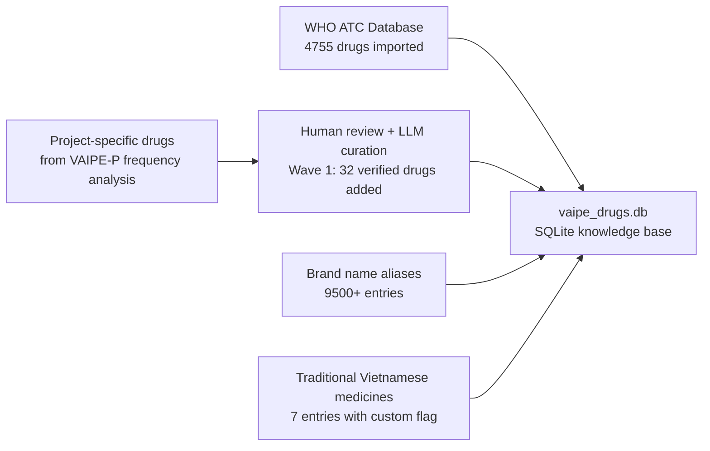

# VSL26 Pipeline Overview

VSL26 converts Vietnamese prescription images into structured Vietnamese Sign Language (VSL) gloss and video assets for a pilot comprehension study with deaf children.

## Section 1: High-Level Pipeline Diagram



## Section 2: Data Flow Diagram

Example prescription: `VAIPE_P_TRAIN_679`, which contains `KAVASDIN 5 5mg` for hypertension.



## Section 3: Knowledge Base Architecture



## Section 4: Pilot Study Setup

| Prescription ID | Target drug detected | Canonical drug | Diagnosis context | What it tests |
|---|---|---|---|---|
| `VAIPE_P_TRAIN_679` | `KAVASDIN 5 5mg` | Amlodipine | Hypertension | Brand-name antihypertensive → generic → hypertension gloss |
| `VAIPE_P_TRAIN_456` | `ENALAPRIL 5mg` | Enalapril | Primary hypertension | Generic antihypertensive with hypertension warning template |
| `VAIPE_P_TRAIN_871` | `AMOXICILIN 500MG 500mg` | Amoxicillin | Injury / infection-adjacent prescription context | Antibiotic gloss and mandatory complete-course warning |
| `VAIPE_P_TRAIN_877` | `PANACTOL 500mg` | Paracetamol | Headache | Pain relief gloss and paracetamol dose-safety warning |

## Section 5: File Structure

```text
VSL26/
├── inference.py              # Stage 2: NER with sliding window
├── ocr_engine.py             # Stage 1: OCR
├── medicine_mapper.py        # Stages 3-4: Mapper + Gloss
├── test_full_pipeline.py     # End-to-end pipeline test
├── test_gloss_engine.py      # Pilot prescription gloss test
├── models/                   # LayoutLMv3 fine-tuned checkpoint
├── public_train/             # VAIPE-P dataset (1173 prescriptions)
├── vaipe_drugs.db            # Knowledge base
├── results/                  # All outputs
└── docs/PIPELINE_OVERVIEW.md # this document
```

## Section 6: Key Research Findings

- LayoutLMv3 `max_length=224` truncation dropped drug rows in long prescriptions; this was solved with sliding-window inference.
- Vietnamese prescriptions use brand names most of the time, not generics, so brand-alias mapping is essential.
- The pipeline abstracts `brand → generic → clinical purpose` so deaf children receive meaning-focused VSL instead of raw drug names.
- Traditional Vietnamese medicines require special handling because many do not have a single Western generic or ATC code.
- The KB was built from WHO ATC plus VAIPE-P frequency-driven curation and Wave 1 human-verified additions.
- Pilot study scope is intentionally narrow: 4 drugs, 4 pilot prescriptions, and fully specified gloss templates.

## Section 7: Current Status & Next Steps

- ✅ OCR pipeline (EasyOCR + VietOCR)
- ✅ NER model (LayoutLMv3 F1 0.9911)
- ✅ Sliding window inference for long documents
- ✅ Bounding box spatial association
- ✅ Drug knowledge base (4760+ drugs)
- ✅ Structured gloss generation (4 sections per drug)
- 🔧 Drug-usage spatial pairing fine-tuning
- ⏸️ VSL footage ID assignment for new gloss tokens
- ⏸️ Video assembly script
- ⏸️ Pilot user evaluation with deaf children
- ⏸️ Ethics approval submission
