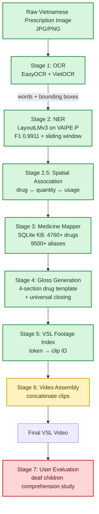

# VSL26 Pipeline Overview Short



```text
VSL26/
├── inference.py              # Stage 2: NER with sliding window
├── ocr_engine.py             # Stage 1: OCR
├── medicine_mapper.py        # Stages 3-4: Mapper + Gloss
├── test_full_pipeline.py     # End-to-end pipeline test
├── test_gloss_engine.py      # Pilot prescription gloss test
├── models/                   # LayoutLMv3 fine-tuned checkpoint
├── public_train/             # VAIPE-P dataset (1173 prescriptions)
├── vaipe_drugs.db            # Knowledge base
├── results/                  # All outputs
└── docs/PIPELINE_OVERVIEW.md # full overview
```

- ✅ OCR pipeline (EasyOCR + VietOCR)
- ✅ NER model (LayoutLMv3 F1 0.9911)
- ✅ Sliding window inference for long documents
- ✅ Bounding box spatial association
- ✅ Drug knowledge base (4760+ drugs)
- ✅ Structured gloss generation (4 sections per drug)
- 🔧 Drug-usage spatial pairing fine-tuning
- ⏸️ VSL footage ID assignment for new gloss tokens
- ⏸️ Video assembly script
- ⏸️ Pilot user evaluation with deaf children
- ⏸️ Ethics approval submission
