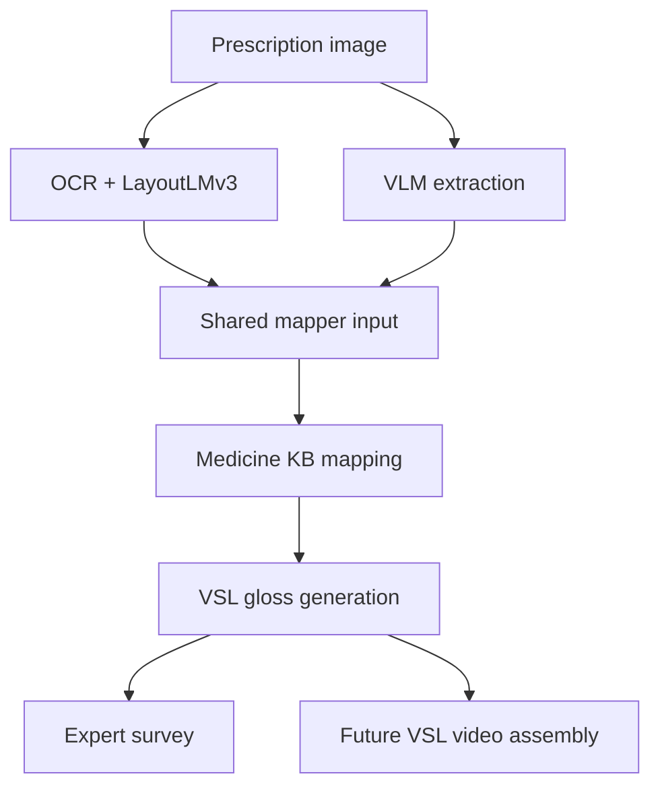

# VSL26 Pipeline Overview Short



## Current Branch Scope

- Implemented: baseline extraction, VLM extraction, shared mapper, gloss export,
  survey package generation, and retraining scripts.
- Pending: expert responses, statistical analysis, and final paper results.
- Future work: VSL footage assignment and video assembly evaluation.

## Key Files

```text
VSL26/
├── README.md
├── AGENTS.md
├── stages/
│   ├── stage_1_ocr/
│   ├── stage_2_extraction/
│   ├── stage_3_mapping/
│   └── stage_4_evaluation/
├── compare_extraction_methods.py  # compatibility wrapper
├── inference.py                   # compatibility wrapper
├── docs/
└── training/
```
